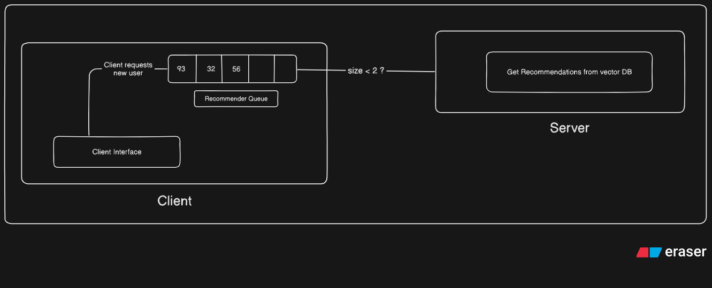

# Citadel Frontend

## How to Run Locally

1. **Clone the repository:**
    ```bash
    git clone https://github.com/your-username/citadel-frontend.git
    cd citadel-frontend
    ```

2. **Install dependencies:**
    ```bash
    npm install
    ```

3. **Set up environment variables:**  
    Copy `.env.example` to `.env` and update values as needed.

4. **Start the development server:**
    ```bash
    npm run dev
    ```

5. **Open your browser:**  
    Visit [http://localhost:3000](http://localhost:3000)

---

## ENV

Environment variables are managed via a `.env` file.  
Typical variables include:

```
PINECONE_API_KEY=
PINECONE_INDEX_HOST=
PINECONE_INDEX_NAME=
```

Refer to `.env.example` for all available options.


## Working Flow



---

## Working Demo

<video src="public/Recording 2025-07-10 160122.mp4" controls width="600">
  Your browser does not support the video tag.
</video>

---

## Design Screenshot


---

## Explain Working

- The frontend is built with [NextJS](https://nextjs.org/).
- It communicates with backend APIs using REST endpoints.
- At backend we have 2 Approaches.

  1. **Pinecone Vector Database**:  
     Uses Pinecone for storing and retrieving user profiles and recommendations.

  2. **Inbuilt Cosine Similarity Calculations**:  
     Implements cosine similarity calculations directly in the backend to generate recommendations.
    
- The frontend displays user profiles, recommendations, and allows interaction with the data.

**At Frontend:**

    1. We maintain a recommender queue that stores user IDs of the next user to be recommended.
    
    2. The queue is processed to fetch recommendations for each user.

    3. Queue is updated everytime it has less than 2 users left.

    4. This queue implementation ensures that the frontend always has a fresh set of recommendations to display.(Makes sure user wait time is less than 100ms)
